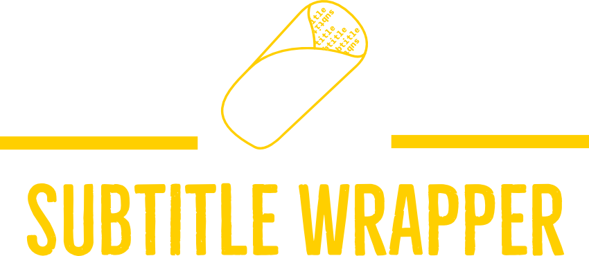

<div align="center">
<p></p>
<div>


</div>
</div>

## Summary

A simple web application to word-wrap .SRT subtitle files.

## How to use
* Go to this link: [this link](https://vrejf-subtitle-wrapper-sub-wrapper-gp2mv5.streamlit.app/)
* Add your srt-file or a bunch of them
* Set the word-wrap limit
* Check the preview and download!

## Features

* Drag and drop SRT files
* Batch process multiple SRT files at ones
* Wraps subtitles word-by-word
* Creates a zip file with timestamp
* Real-time preview
* Only takes SRT files


## Demo


## Example
#### This long caption:

```
 - My mama always said life was like a box of chocolates. You never know what you're gonna get
 ```
 #### Will become this:

```
- My mama always said life was like a box of chocolates. 
  You never know what you're gonna get.
```


## Acknowledgements
* [srt](https://pypi.org/project/srt/)
* [Streamlit](https://streamlit.io)